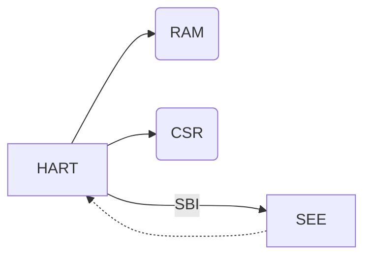

# RISC-V Rust Emulator (RV32I)

This project aims to provide a learning platform for RISC-V and Rust.



* `RAM` is shared between one or more `hart`
* `SEE` is global
* `CSR`s are per `hart` (or per core)
* The `SEE` can control all `hart`s

### Glossary

|      | Definition                       |
|------|----------------------------------|
| HART | Hardware Thread                  |
| CSR  | Control and Status Registers     |
| SBI  | Supervisor Binary Interface      |
| SEE  | Supervisor Execution Environment |
| ISA  | Instruction Set Architecture     |
| M    | Machine Mode                     |
| XLEN | RISC-V 32 or 64 flavour          |
| EEI  | Execution Environment Interface  |
| ABI  | Application Binary Interface     |

## Development

```
make -C test
cargo test
cargo run
```

## Licensing

```
   Copyright 2023 Jonathan Buch

   Licensed under the Apache License, Version 2.0 (the "License");
   you may not use this file except in compliance with the License.
   You may obtain a copy of the License at

       http://www.apache.org/licenses/LICENSE-2.0

   Unless required by applicable law or agreed to in writing, software
   distributed under the License is distributed on an "AS IS" BASIS,
   WITHOUT WARRANTIES OR CONDITIONS OF ANY KIND, either express or implied.
   See the License for the specific language governing permissions and
   limitations under the License.
```

## Literature

* [RISC-V ISA Volume 1](https://riscv.org/technical/specifications/)
* [RISC-V ISA Volume 2](https://riscv.org/technical/specifications/)
* [RISC-V Technical Specifications](https://wiki.riscv.org/display/HOME/RISC-V+Technical+Specifications)
* [RISC-V SBI](https://github.com/riscv-non-isa/riscv-sbi-doc)
* [RISC-V ELF psABI](https://github.com/riscv-non-isa/riscv-elf-psabi-doc)
* [The RISC-V Microcontroller Profile](https://github.com/emb-riscv/specs-markdown)
* [RISC-V Online Assembler](https://riscvasm.lucasteske.dev/#)
* [DarkRISCV](https://github.com/darklife/darkriscv)
* [RISC-V GNU Toolchain](https://github.com/riscv-collab/riscv-gnu-toolchain)
* [OpenHW Group CV32E40S User Manual](https://docs.openhwgroup.org/projects/cv32e40s-user-manual/en/latest/index.html)
* [Misunderstanding RISC-V ecalls and syscalls](https://jborza.com/emulation/2021/04/22/ecalls-and-syscalls.html)
* [Rust interior mutability](https://doc.rust-lang.org/book/ch16-03-shared-state.html)
* [UART Communications RISC-V OS In Rust](https://osblog.stephenmarz.com/ch2.html)
* [RISC-V from scratch 3](https://twilco.github.io/riscv-from-scratch/2019/07/08/riscv-from-scratch-3.html)
* [rustsbi](https://docs.rs/rustsbi/latest/rustsbi/)
* [emuriscv](https://github.com/jborza/emuriscv)
* [The Sodor Processor Collection](https://github.com/ucb-bar/riscv-sodor)
* [An overview of OpenSBI](https://www.thegoodpenguin.co.uk/blog/an-overview-of-opensbi/)
* [Trivial RISC-V Linux Binary Bootloader](https://github.com/ultraembedded/riscv-linux-boot)
* [Rare: Rust A RISC-V Emulator](https://siriusdemon.github.io/Rare/v3-CSR.html)
* [Writing a RISC-V Emulator in Rust](https://book.rvemu.app/index.html)
