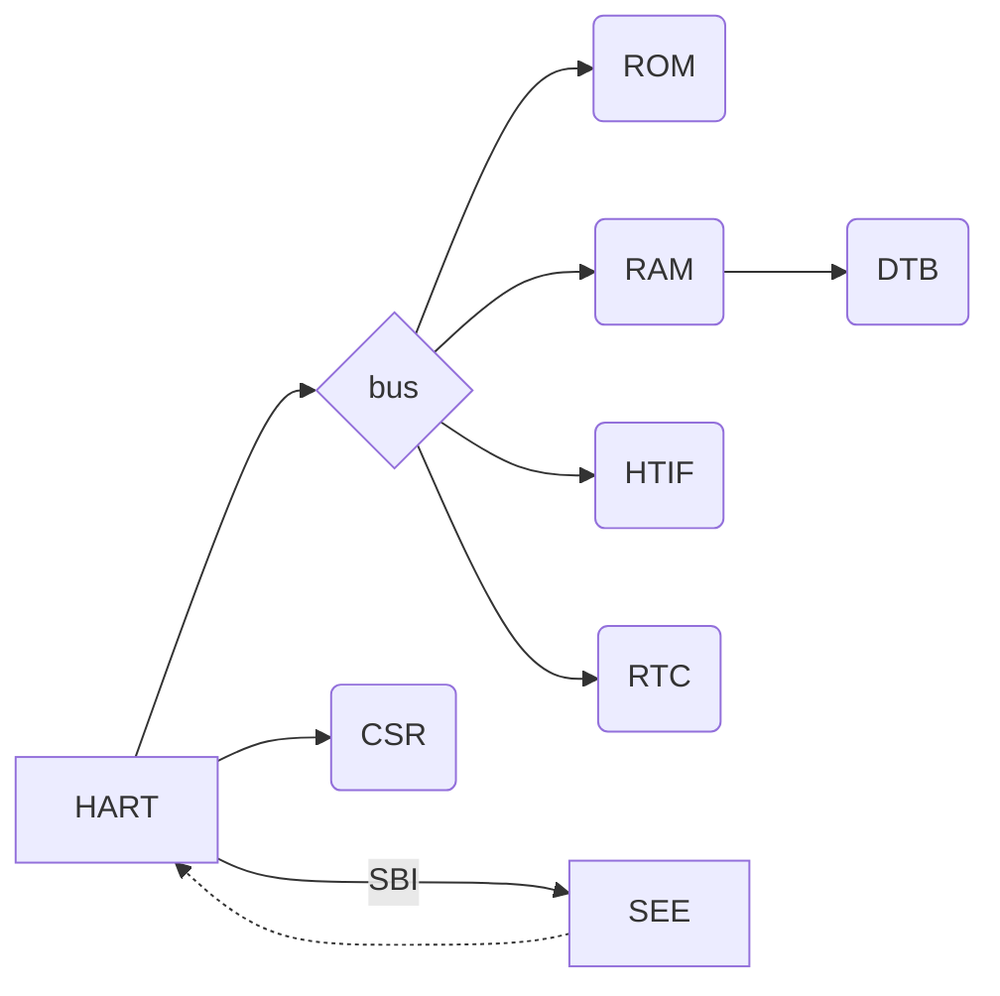

# Rust RISC-V Emulator (RV64IAC)

This project aims to provide a learning platform for RISC-V and Rust.



* `RAM` is shared between one or more `hart`s via the bus
* `ROM` is shared between one or more `hart`s via the bus
* `RTC` is memory mapped and reachable from the bus
* `SEE` is global
* `CSR`s are per `hart` (or per core)
* The `SEE` can control all `hart`s
* The device tree (`DTB`) is accessible via `RAM`

### Glossary

|       | Definition                          |
|-------|-------------------------------------|
| HART  | Hardware Thread                     |
| CSR   | Control and Status Registers        |
| SBI   | Supervisor Binary Interface         |
| SEE   | Supervisor Execution Environment    |
| ISA   | Instruction Set Architecture        |
| M     | Machine Mode                        |
| XLEN  | RISC-V 32 or 64 flavour             |
| EEI   | Execution Environment Interface     |
| ABI   | Application Binary Interface        |
| RTC   | Real Time Clock                     |
| DTS   | Device Tree Source                  |
| FTD   | Flattened Device Tree               |
| DTB   | Device Tree Blob                    |
| HTIF  | Deprecated Host Device              |
| FESVR | RISC-V Frontend Server              |
| CLINT | Core Local Interruptor              |
| PLIC  | Platform-Level Interrupt Controller |
| AMO   | Atomic Memory Operation             |

## Development

```shell
make -C test
cargo test
cargo run
```

### Verification

```shell
cd validation
podman build -t riscvvalidation .
podman run -it -v $PWD:/work:z -v $PWD/../target:/target riscvvalidation --verbose info arch-tests --clone
podman run -it -v $PWD:/work:z -v $PWD/../target:/target riscvvalidation
```

## Licensing

```
Copyright 2023 Jonathan Buch

Licensed under the Apache License, Version 2.0 (the "License");
you may not use this file except in compliance with the License.
You may obtain a copy of the License at

   https://www.apache.org/licenses/LICENSE-2.0

Unless required by applicable law or agreed to in writing, software
distributed under the License is distributed on an "AS IS" BASIS,
WITHOUT WARRANTIES OR CONDITIONS OF ANY KIND, either express or implied.
See the License for the specific language governing permissions and
limitations under the License.
```

## Literature

### Specs

* [RISC-V ISA Volume 1](https://riscv.org/technical/specifications/)
* [RISC-V ISA Volume 2](https://riscv.org/technical/specifications/)
* [RISC-V Technical Specifications](https://wiki.riscv.org/display/HOME/RISC-V+Technical+Specifications)
* [RISC-V SBI](https://github.com/riscv-non-isa/riscv-sbi-doc)
* [RISC-V ELF psABI](https://github.com/riscv-non-isa/riscv-elf-psabi-doc)
* [The RISC-V Microcontroller Profile](https://github.com/emb-riscv/specs-markdown)
* [RISC-V Counters (Zinctr)](https://five-embeddev.com/riscv-isa-manual/latest/counters.html)
* [RISC-V ACLINT](https://github.com/riscv/riscv-aclint)
* [RISC-V PLIC](https://github.com/riscv/riscv-plic-spec)

### Software

* [RISC-V Online Assembler](https://riscvasm.lucasteske.dev/#)
* [DarkRISCV](https://github.com/darklife/darkriscv)
* [RISC-V GNU Toolchain](https://github.com/riscv-collab/riscv-gnu-toolchain)
* [OpenHW Group CV32E40S User Manual](https://docs.openhwgroup.org/projects/cv32e40s-user-manual/en/latest/index.html)
* [rustsbi](https://docs.rs/rustsbi/latest/rustsbi/)
* [emuriscv](https://github.com/jborza/emuriscv)
* [Linux Kernel RISC-V architecture](https://docs.kernel.org/arch/riscv/index.html)

### Misc

* [Misunderstanding RISC-V ecalls and syscalls](https://jborza.com/emulation/2021/04/22/ecalls-and-syscalls.html)
* [Rust interior mutability](https://doc.rust-lang.org/book/ch16-03-shared-state.html)
* [UART Communications RISC-V OS In Rust](https://osblog.stephenmarz.com/ch2.html)
* [RISC-V from scratch 3](https://twilco.github.io/riscv-from-scratch/2019/07/08/riscv-from-scratch-3.html)
* [The Sodor Processor Collection](https://github.com/ucb-bar/riscv-sodor)
* [An overview of OpenSBI](https://www.thegoodpenguin.co.uk/blog/an-overview-of-opensbi/)
* [Trivial RISC-V Linux Binary Bootloader](https://github.com/ultraembedded/riscv-linux-boot)
* [Rare: Rust A RISC-V Emulator](https://siriusdemon.github.io/Rare/v3-CSR.html)
* [Writing a RISC-V Emulator in Rust](https://book.rvemu.app/index.html)
* [Summit Bootflow](https://riscv.org/wp-content/uploads/2019/12/Summit_bootflow.pdf)
* [Baremetal Timer](https://five-embeddev.com/baremetal/timer/)
* [RISC-V: A Bare-metal Introduction using C++. Machine Mode Timer](https://philmulholland.medium.com/risc-v-a-bare-metal-introduction-with-c-machine-mode-timer-790f55f2c96c)
* [Demystifying the RISC-V Linux software stack](https://www.european-processor-initiative.eu/wp-content/uploads/2022/06/Nick-Kossifidis-@-RISC-V-Week.pdf)
* [6.S081: Interrupts](https://pdos.csail.mit.edu/6.828/2021/slides/6s081-lec-interrupts.pdf)
* [RISC-V Bytes: Introduction to Instruction Formats](https://danielmangum.com/posts/risc-v-bytes-intro-instruction-formats/)

### Device Trees

* [example DTS for the HiFive Unleashed](https://github.com/riscv-non-isa/riscv-device-tree-doc/blob/master/examples/sifive-hifive_unleashed-microsemi.dts)
* [Device Node Requirements](https://devicetree-specification.readthedocs.io/en/latest/chapter3-devicenodes.html)
* [Device Tree Usage](https://elinux.org/Device_Tree_Usage)
* [Introduction to Device Trees](https://www.nxp.com/docs/en/application-note/AN5125.pdf)

### Validation

* [RISCOF](https://riscof.readthedocs.io/en/latest/installation.html)
* [HTIF](https://github.com/riscv-software-src/riscv-isa-sim/issues/364)
* [Spike](https://chipyard.readthedocs.io/en/latest/Software/Spike.html)
